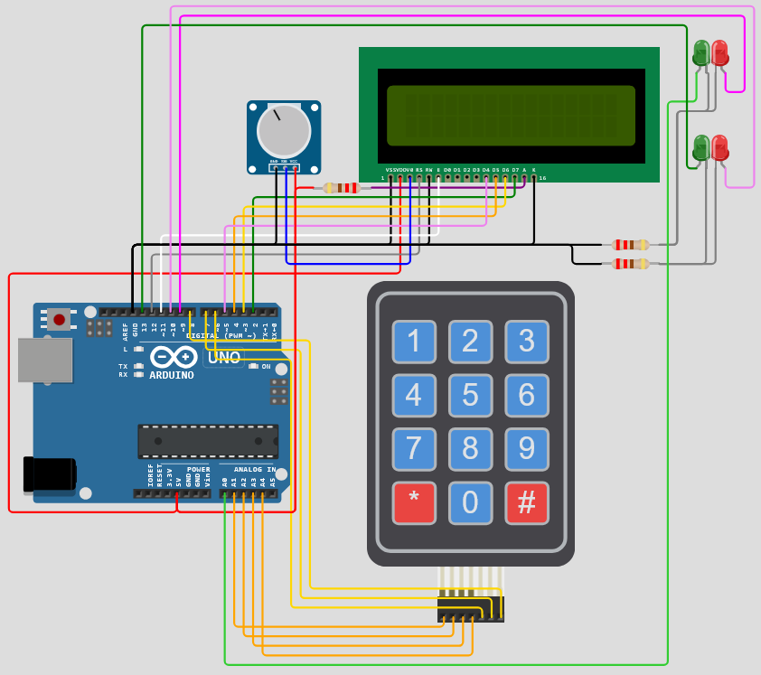

# Kod Dostępu - Arduino

W ramach [Warsztatowego Kalendarza Adwentowego](https://discord.com/channels/822931925618524240/909046389227536426/1450223045506629777) - wyzwania odbywającego się na [discordowym serwerze poświęconym serii "Przygody Reksia"](https://discord.gg/sc5psH2cvR) - postanowiłem odtworzyć z użyciem mikrokontrolera Arduino zabezpieczenie bramy portu kosmicznego z gry "Reksio i UFO".

https://github.com/user-attachments/assets/2c5230cf-48fb-45f4-8fdd-3b31e16b5779

Działającą[^1] symulację możesz przetestować [tutaj](https://wokwi.com/projects/450800315035824129). Wideoprezentacja z fizycznej implementacji poniżej.

https://github.com/user-attachments/assets/7436784d-481d-48ec-a082-9a64f00941d4

## Wymagane komponenty

- Arduino (inne niż Uno/Leonardo wymagać będzie zmian w kodzie)
- wyświetlacz LCD 16x2 (kompatybilny ze sterownikiem HD44780)
- membranowa klawiatura numeryczna 4x3
- 2 zielone i 2 czerwone diody świecące
- 3 oporniki 220 omów
- potencjometr do sterowania kontrastem wyświetlacza

## Kompilacja

Plik [KodDostepu.ino](KodDostepu.ino) należy uruchomić z użyciem Arduino IDE. Wymagane biblioteki to: Keypad[^2] w wersji 3.x.x oraz LiquidCrystal[^3] w wersji 1.x.x.

## Schemat połączeń

| Arduino | LCD | Klawiatura | LED |
|-|-|-|-|
| 2 | D7 | - | - |
| 3 | D6 | - | - |
| 4 | D5 | - | - |
| 5 | D4 | - | - |
| 6 | - | C0 | - |
| 7 | - | C1 | - |
| 8 | - | C2 | - |
| 9 | - | - | górna czerwona (+) |
| 10 | - | - | dolna czerwona (+) |
| 11 | En | - | - |
| 12 | RS | - | - |
| 13 | - | - | dolna zielona (+) |
| A0 | - | - | górna zielona (+) |
| A1 | - | R0 | - |
| A2 | - | R1 | - |
| A3 | - | R2 | - |
| A4 | - | R3 | - |

[^1]: Prawie... Wokwi wydaje się mieć problem z wyświetlaczem 16x2 przyciętym do 4x1 za pomocą komendy `lcd.begin(4, 1);`
[^2]: Autorzy: Mark Stanley, Alexander Brevig
[^3]: Autorzy: Arduino, Adafruit
